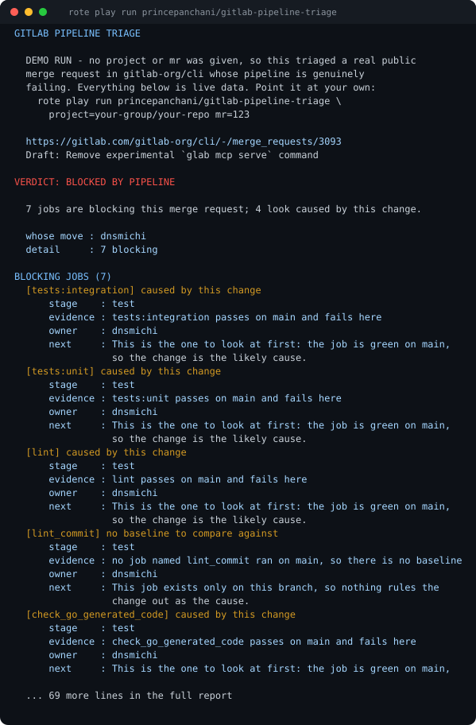
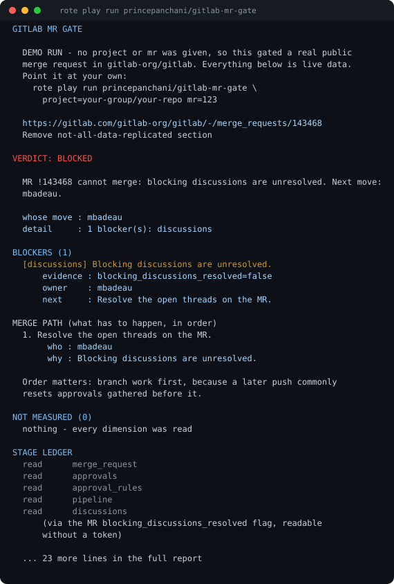
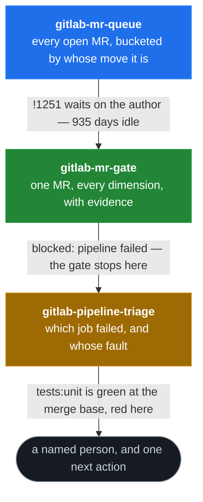
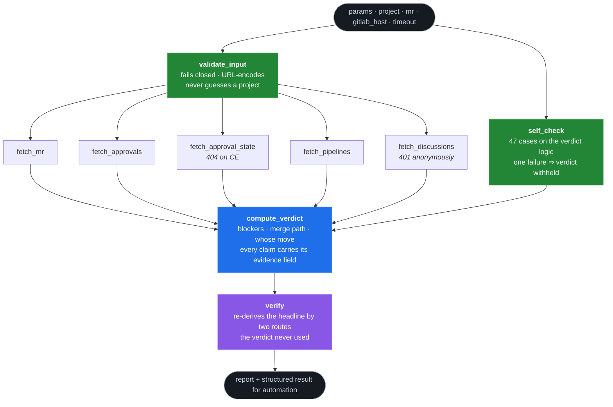
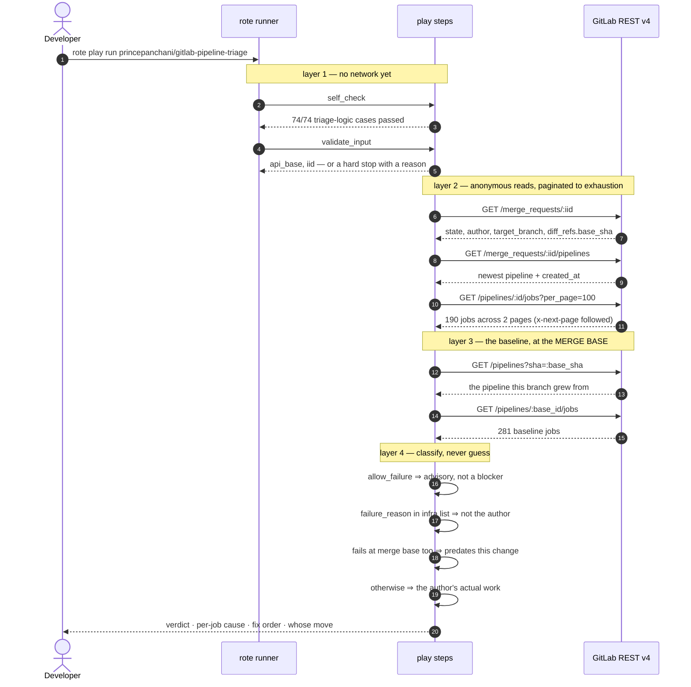

# GitLab merge-readiness plays for Rote

**Three published [Rote](https://play.modiqo.ai) plays that each answer one
question about GitLab merge requests — and refuse to answer when they cannot.**

All three run with **no arguments, no credentials and no setup**, on gitlab.com
and on self-hosted GitLab. Everything below is evidence from real runs against
projects the author does not control.

| Play                     | The question it answers                                                                                 | Registry                                                                                              |
| ------------------------ | ------------------------------------------------------------------------------------------------------- | ----------------------------------------------------------------------------------------------------- |
| `gitlab-mr-gate`         | Can **this** merge request merge? If not, what blocks it, and whose move is it?                         | [princepanchani/gitlab-mr-gate](https://play.modiqo.ai/princepanchani/gitlab-mr-gate)                 |
| `gitlab-mr-queue`        | Across **every** open merge request, whose move is it — and how long has it been waiting?               | [princepanchani/gitlab-mr-queue](https://play.modiqo.ai/princepanchani/gitlab-mr-queue)               |
| `gitlab-pipeline-triage` | The pipeline is red. **Which job** failed, is it your change or already broken, and does it even block? | [princepanchani/gitlab-pipeline-triage](https://play.modiqo.ai/princepanchani/gitlab-pipeline-triage) |

## Watch it run

[](https://www.youtube.com/watch?v=p65GLRVcewM)

> **[▶ Watch the demo on YouTube](https://www.youtube.com/watch?v=p65GLRVcewM)**
>
> Every terminal window in the video replays **real captured stdout** from
> `rote play run`. Everything outside a terminal is explanatory motion graphics,
> drawn in a deliberately different visual language so it is never unclear which
> is which.

## What the output actually looks like

Real stdout from `rote play run princepanchani/gitlab-pipeline-triage`, with no
arguments, against a live public merge request whose pipeline is genuinely
failing. Seven jobs block it; four are attributable to the change, three have no
baseline to compare against — and the play says which is which.

<p align="center">
  
</p>

<details>
<summary><b>And the gate, on a different merge request</b></summary>

<p align="center">
  
</p>

The raw captured text behind both images is committed alongside them in
[`docs/assets/`](docs/assets), so the pictures can be checked against the
reports they were rendered from.

</details>

## The problem

GitLab already knows why your merge request will not merge. It just tells you in
pieces, across five endpoints, in fields whose names are not the words a human
would use — and it never tells you **whose move it is**.

So a team ends up asking three questions over and over:

1. _"Can this one merge yet, and if not, what do I actually do?"_ — you click
   through approvals, threads, the pipeline, the draft flag, CODEOWNERS.
2. _"What is stuck across the whole project?"_ — nobody knows, because nobody
   opens sixty merge requests.
3. _"The pipeline is red — is that me?"_ — the single most common blocker, and
   the least actionable thing GitLab says.

These three plays answer those three questions, in that order. They compose, and
each says so in its own registry description — but each is useful alone.

## How the three fit together



The handoff is the point. The gate deliberately stops at _"the pipeline failed"_
— naming it as one blocker among many — because going further is a different
question with a different baseline. The triage play picks it up there.

## Architecture

Every play is the same shape: **a DAG of small processes that each read exactly
one thing, and a presentation program that renders what they found.** No step
interprets another step's job.



Two structural choices carry most of the weight:

- **The self-check runs in layer 1, before any live read.** If the verdict logic
  cannot reproduce 47 known answers, the play refuses to judge a real merge
  request at all. A gate whose own logic is broken must not guess.
- **The verify stage runs last and is deliberately redundant.** It re-derives
  the headline claim by routes the verdict never used — a fresh second read, and
  GitLab's own server-side `detailed_merge_status`. `CONTRADICTED` tells you to
  trust GitLab and treat the pass as unsafe.

## What happens on one run



The merge base is the detail that makes attribution honest. Comparing against
the target branch's _current_ pipeline would blame the author for a regression
somebody else pushed after their pipeline ran. Comparing against the commit the
branch grew from cannot. When no merge-base pipeline exists, the play falls back
to the branch tip **and says so**, reporting the cause as unproven rather than
assigning blame it cannot support.

## Try them

```bash
rote play run princepanchani/gitlab-mr-gate
rote play run princepanchani/gitlab-mr-queue
rote play run princepanchani/gitlab-pipeline-triage
```

With no arguments each runs a built-in demo against a real public merge request,
so you see a full report before deciding whether to point it at your own:

```bash
rote play run princepanchani/gitlab-mr-gate project=your-group/your-repo mr=123
rote play run princepanchani/gitlab-mr-queue project=your-group/your-repo
```

Self-hosted GitLab works the same way — point `gitlab_host` at it. KDE's
instance is public, so this second demo also runs for anyone:

```bash
rote play run princepanchani/gitlab-mr-gate gitlab_host=invent.kde.org project=frameworks/kio mr=2417
```

## Why GitLab

Every other merge-readiness play in the registry targets GitHub. GitLab
publishes `detailed_merge_status` — its own one-field diagnosis of why a merge is
refused — and GitHub has no equivalent. All three plays read it, and the gate
then turns it around and uses it as an **independent witness against its own
verdict**.

## Design rules

These are the constraints the code is actually written to, not aspirations.

- **Read-only.** Nothing approves, merges, rebases, retries, comments or labels.
- **Unknown is never clean.** A dimension that could not be read is reported as
  unknown and downgrades the verdict; it is never silently treated as passing.
- **Fail closed, but only where the ambiguity is real.** A 404 aborts the run
  for the merge request itself — the dimension that guards project existence —
  and degrades to unknown for a sub-resource that was reached at all.
- **The stage ledger names the route.** When an answer came by a weaker route —
  discussions decided from `blocking_discussions_resolved` rather than a
  per-thread read, or a baseline taken from the branch tip rather than the merge
  base — the report says so.
- **No judgment from author-controlled text.** Titles and descriptions are
  carried for display and read by no rule, so an MR asking to be approved cannot
  move the verdict. Job logs are never parsed at all.
- **Self-check before live data.** 47 cases against the gate's verdict logic and
  74 against the triage logic, roughly half of them negative assertions — things
  the logic must _refuse_ to say. If one fails, the verdict is withheld.
- **Only provable claims.** "Already broken, not your move" is asserted only
  when the baseline provably predates the change. Otherwise the play reports the
  cause as unproven.
- **"Failed" is not one thing.** A red pipeline mixes jobs GitLab was told not
  to care about (`allow_failure`), runners that died, and jobs already broken at
  the merge base. Conflating them is why teams stop trusting red pipelines.
- **Verify by a different route.** A fresh second read plus GitLab's own
  server-side verdict. `CONTRADICTED` means trust GitLab, not this play.
- **Nothing overruns a terminal.** Every field built from live data — usernames,
  branch names, rule paths, MR titles, label lists — has unpredictable length
  and is wrapped or clipped. The conformance sweep asserts no report line
  exceeds 78 columns. URLs are the one exemption, because a hard newline through
  a URL stops a terminal making it clickable.
- **Scalars only across step edges.** Rote value edges must resolve to scalars,
  so steps emit fixed-shape flat records — every key always present, sentinels
  (`-1`, `"unmeasured"`) on degrade, never `null` and never a missing key. Where
  structure must cross an edge it is delimiter-**escaped**, not replaced, so
  distinct job names cannot collapse onto one key.

## Conformance

Every row is a real run against a real merge request on a real GitLab instance,
with no credentials. Reproduce all of it with one command:

```bash
bash src/conformance.sh
```

| Target                                               | Edition | Case                                  | Result           |
| ---------------------------------------------------- | ------- | ------------------------------------- | ---------------- |
| `gitlab.com` `gitlab-org/gitlab!143468`              | EE      | zero-arg demo, unresolved discussions | `BLOCKED`        |
| `gitlab.com` `gitlab-org/cli!3852`                   | EE      | merged MR                             | `NOT OPEN`       |
| `gitlab.com` `gitlab-org/cli!3857`                   | EE      | closed MR                             | `NOT OPEN`       |
| `invent.kde.org` `frameworks/kio`                    | CE      | live MR, self-hosted                  | real verdict     |
| `salsa.debian.org` `debian/adduser!143`              | CE      | live MR, self-hosted                  | real verdict     |
| `gitlab.gnome.org` `GNOME/gnome-settings-daemon!493` | CE      | live MR, self-hosted                  | real verdict     |
| `gitlab.freedesktop.org` `xdg/shared-mime-info!431`  | CE      | live MR, self-hosted                  | real verdict     |
| `code.videolan.org` `videolan/vlc!10155`             | CE      | live MR, self-hosted                  | real verdict     |
| nonexistent MR / project / host / non-numeric `mr`   | —       | must never read green                 | `UNAVAILABLE` ×4 |
| `gitlab-org/cli!2950`                                | EE      | MR that never had a pipeline          | `NO PIPELINE`    |
| `frameworks/kio` green pipeline                      | CE      | must not invent a failure             | `PIPELINE GREEN` |

**Why Community Edition is the interesting column.** Merge request approval
_rules_ are a GitLab Premium/Ultimate feature, so on Community Edition — which
is most self-hosted GitLab — `/approval_state` returns **404 while every other
dimension reads perfectly well**. An earlier version treated that 404 as
"project not found", which made the plays unrunnable against _any_ CE instance.
They now report approval rules as unknown and downgrade the verdict, exactly as
"unknown is never clean" requires. Plain `/approvals` still works on CE, so
approval counts are unaffected.

**Why live rows assert a verdict rather than _the_ verdict.** For third-party
merge requests the sweep checks only that the play committed to a real answer —
anything but `UNAVAILABLE` or `WITHHELD`. The KDE merge request above was rebased
while this was being written and legitimately changed verdict; a suite that pins
an exact answer to someone else's branch produces false failures and then gets
ignored. Deterministic inputs still assert exactly.

## Credentials

No credentials at all on public projects. A private or self-hosted project uses
your own `GITLAB_TOKEN` read from the environment, sent as a request **header**,
never as a query string, never printed, and never a play parameter. Only a
boolean about its presence appears in any output.

`PRIVATE-TOKEN` and `JOB-TOKEN` are sent as the distinct headers GitLab expects,
because collapsing them makes a correctly configured CI job token fail
authentication.

The token path is verified end to end against a real private gitlab.com project.
**A token against a self-hosted instance is still untested** — the five
self-hosted instances above were all read anonymously — and that limit is stated
in all three published descriptions rather than quietly dropped.

## Layout

One directory per play, all three siblings, plus what is shared:

```
src/
  conformance.sh         real runs across 6 GitLab instances + failure modes,
                         sweeping all three plays

  gate/                  gitlab-mr-gate
    main.ts              frontmatter + DAG + presentation program
    validate.py          input validation, fails closed
    fetch.py             one GitLab read per surface
    verdict.py           the gate logic; blockers, merge path, headline
    selfcheck.py         47 bundled cases, half negative assertions
    verify.py            re-derives claims by a second route
    build.sh             assemble into ~/.rote/flows/... inside WSL
    harvest_fixtures.py  copy real run evidence into presentation fixtures

  queue/                 gitlab-mr-queue
    list_mrs.py          the merge request list, paginated to exhaustion
    gate_one.py          per-MR gate, fanned out by the DAG
    ...                  main.ts, validate.py, build.sh as above

  triage/                gitlab-pipeline-triage
    triage.py            classifies each failed job; 74 self-check cases
    fetch.py             pipelines, jobs, and the merge-base baseline
    ...                  main.ts, validate.py, build.sh as above

  tools/                 one-off measurement helpers, not part of any package
    measure.sh           token cost of the naive approach vs the gate
    measure_queue.sh     the same for the queue, showing how it scales
    record_verdict.sh    records the verdict step against real measurements

docs/assets/             the captured reports behind the images above
```

`src/` is canonical. Each play's `build.sh` deploys into
`/root/.rote/flows/princepanchani/` inside WSL; the flows directory is build
output, not source.

## Build, test, publish

Rote does not run on native Windows — everything below is inside WSL.

```bash
bash src/gate/build.sh                                # assemble the gate
bash src/queue/build.sh                               # and the queue
bash src/triage/build.sh                              # and the triage
python3 src/gate/selfcheck.py src/gate/verdict.py     # 47/47 expected
python3 src/triage/selfcheck.py src/triage/triage.py  # 74/74 expected
rote play lint  /root/.rote/flows/princepanchani/gitlab-mr-gate/main.ts
bash src/conformance.sh                               # the full sweep
rote registry play push /root/.rote/flows/princepanchani/gitlab-mr-gate princepanchani --dry-run
```

Drop `--dry-run` to publish. **Registry versions are immutable** — every change
is a version bump, and a published version's bytes can never be edited.
Publishing does not replace the previous version: it stays in the registry, but
`play info` reports only the newest and `play pull` has no `--version` flag, so
the newest is what anyone actually gets. A version can be withdrawn —
`registry play delete --version` is a _recoverable_ delete, with
`registry play restore --version` as its inverse — but never rewritten in place.

Anyone who already installed an older version keeps running it: a bare
`<slug>/<name>` resolves to the local flows directory when one exists, so
converging on a new version needs an explicit `registry play pull`.

Two gotchas worth knowing if you fork this:

- The registry rejects an over-long play `description`. Around 2,900 characters
  is the working ceiling; a rejected push does **not** consume the version
  number, so trimming and retrying the same version works.
- `registry play pull` fails when two retained backups collide under
  `~/.rote/flows/<slug>/.backups/`, and until that is cleared it leaves **stale
  code in place**. Always check the installed `version:` line rather than
  assuming a pull succeeded.

## Author

Built by **Prince Panchani** for [The First Rote Playoffs](https://play.modiqo.ai).

|                      |                                                                                                                            |
| -------------------- | -------------------------------------------------------------------------------------------------------------------------- |
| Rote registry handle | `princepanchani` — every play above is published under this namespace, which is what identifies the author in the registry |
| GitHub               | [@PrinceXDev](https://github.com/PrinceXDev) — this repository                                                             |
| LinkedIn             | [prince-panchani-70757b202](https://www.linkedin.com/in/prince-panchani-70757b202/)                                        |

The registry handle (`princepanchani`) and the GitHub account (`PrinceXDev`) are
the same person; they are spelled out here because the two names do not look
alike and nothing else in the repository asserts the link.
